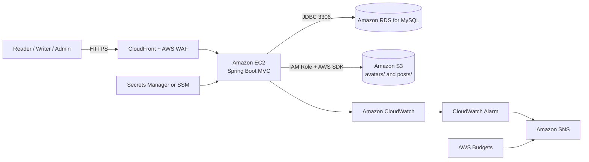

## Overview

This workshop deploys **TechBlog**, a Java 17 and Spring Boot 3.5 technology blog using Spring MVC, Spring Security, JPA/Hibernate, Thymeleaf, MySQL, and Maven.

The architecture follows Section 2: CloudFront and AWS WAF expose the application, Amazon EC2 runs the Spring Boot JAR, Amazon RDS for MySQL stores business data, and Amazon S3 stores avatars and post images. IAM, Secrets Manager or Parameter Store, CloudWatch, SNS, and AWS Budgets provide security, monitoring, and cost control.

The cost-focused demo excludes NAT Gateway, Application Load Balancer, Auto Scaling, and RDS Multi-AZ.

## Architecture

## Contents

1. [Workshop overview](5.1-workshop-overview/)
2. [Prerequisites](5.2-prerequisites/)
3. [Network and Amazon RDS](5.3-network-rds/)
4. [Deploy TechBlog on Amazon EC2](5.4-deploy-ec2/)
5. [Integrate S3, IAM, CloudFront, and WAF](5.5-storage-security/)
6. [Test, monitor, and troubleshoot](5.6-test-monitor/)
7. [Clean up resources](5.7-cleanup/)
