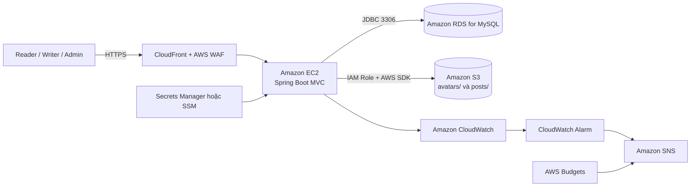

## Tổng quan

Workshop này hướng dẫn triển khai **TechBlog**, ứng dụng blog công nghệ sử dụng Java 17, Spring Boot 3.5, Spring MVC, Spring Security, Spring Data JPA/Hibernate, Thymeleaf, MySQL và Maven, lên AWS dưới dạng bản demo hoàn chỉnh.

Kiến trúc bám sát đề xuất ở mục 2: CloudFront và AWS WAF cung cấp endpoint public; Amazon EC2 chạy ứng dụng Spring Boot; Amazon RDS for MySQL lưu dữ liệu; Amazon S3 lưu avatar và ảnh bài viết. IAM Role, Secrets Manager hoặc Systems Manager Parameter Store, CloudWatch, SNS và AWS Budgets hỗ trợ bảo mật, giám sát và kiểm soát chi phí.

### Các dịch vụ chính

- **Amazon EC2** chạy file JAR của TechBlog bằng Java 17.
- **Amazon RDS for MySQL** lưu user, bài viết, category, comment, report, like và save.
- **Amazon S3** lưu avatar và ảnh bài viết, tách file khỏi vòng đời EC2.
- **Amazon CloudFront và AWS WAF** tạo lớp truy cập public và bảo vệ ứng dụng.
- **AWS IAM Role** cấp quyền tối thiểu cho EC2 mà không dùng Access Key tĩnh.
- **Secrets Manager hoặc SSM Parameter Store** bảo vệ thông tin kết nối database.
- **Amazon CloudWatch và Amazon SNS** thu thập log, tạo alarm và gửi email cảnh báo.
- **AWS Budgets** cảnh báo chi phí cho môi trường demo.

Workshop ưu tiên chi phí thấp nên chưa sử dụng NAT Gateway, Application Load Balancer, Auto Scaling hoặc RDS Multi-AZ. Người học kiểm tra EC2 qua cổng 8080 trước, sau đó mới đặt CloudFront và WAF phía trước.

## Kiến trúc

## Nội dung

1. [Tổng quan workshop](5.1-workshop-overview/)
2. [Điều kiện tiên quyết](5.2-prerequisites/)
3. [Chuẩn bị mạng và Amazon RDS](5.3-network-rds/)
4. [Triển khai TechBlog trên Amazon EC2](5.4-deploy-ec2/)
5. [Tích hợp S3, IAM, CloudFront và WAF](5.5-storage-security/)
6. [Kiểm thử, giám sát và xử lý sự cố](5.6-test-monitor/)
7. [Dọn dẹp tài nguyên](5.7-cleanup/)
